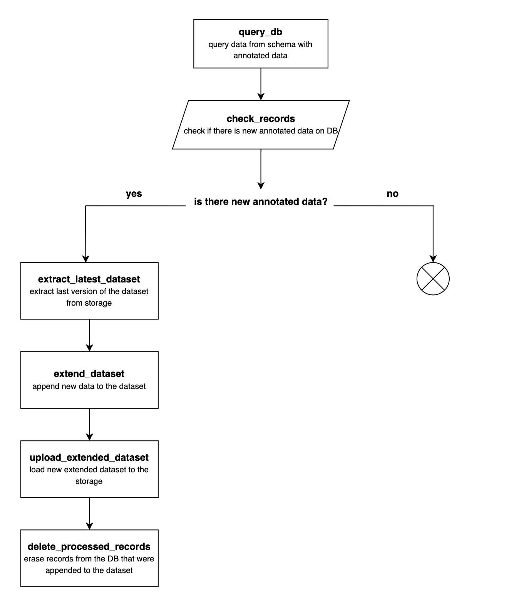

## Airflow DAG Pipeline

This directory contains the setup of an Apache Airflow DAG pipeline designed to manage new training data for a text simplification project. The pipeline performs the following operations:

### 1. Database Query
- Queries a PostgreSQL database to fetch rows from the table with annotated complex-simple sentence pairs.
- Fetches text records for training purposes.
- The results are temporarily stored using Airflow's XCom for downstream tasks.

### 2. Extract the Last Version of the Dataset
- Connects to Google Cloud Storage (GCS) and identifies the latest version of the dataset based on a prefix (e.g., `wikilarge_`).
- Downloads the latest dataset files to a local temporary directory.

### 3. Extend Dataset
- Appends the new records fetched from the PostgreSQL database to the training dataset files.
- Logs the number of records in each dataset file both before and after extending them.

### 4. Upload Extended Dataset
- Creates a unique prefix for the new version of the dataset using the current Unix timestamp (e.g., `wikilarge_1720265148`).
- Uploads the extended dataset files back to GCS under the new prefix.

### 5. Delete Processed Records
- Deletes the records that were fetched from the database to prevent duplicate processing in future runs.

**<h2 style="text-align: center;">Pipeline Diagram
**

